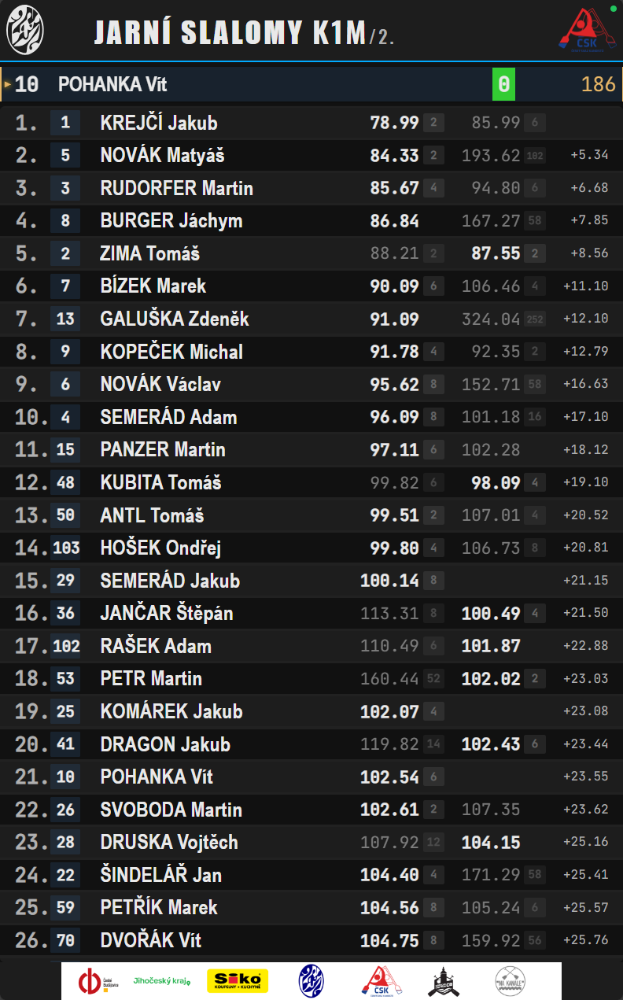
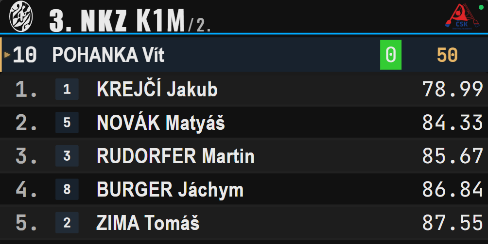

# C123 Scoreboard

Real-time scoreboard for canoe slalom races. Connects to C123 Server for live timing data.

| Vertical Layout | Ledwall Layout |
|:---------------:|:--------------:|
|  |  |

## Features

- **Zero configuration** - Auto-discovers C123 Server on the network
- **Two layouts** - Vertical (portrait TV) and Ledwall (wide LED panels)
- **BR1/BR2 display** - Shows both run times for dual-run races
- **Remote configuration** - Manage displays from C123 Server admin
- **Custom assets** - Logos and banners via admin or URL parameters
- **Finish highlight** - Automatic scroll and highlight on competitor finish

## Quick Start

```bash
npm install
npm run dev
```

Opens at http://localhost:5173 with sample replay data.

### Connect to C123 Server

```
http://localhost:5173/?server=192.168.1.50:27123
```

Or let auto-discovery find the server:

```
http://localhost:5173/
```

## Deployment

### Build for Production

```bash
npm run build
```

Deploy the `dist/` folder to any web server.

### Raspberry Pi (FullPageOS)

1. Build and deploy `dist/` to a web server
2. Install [FullPageOS](https://github.com/guysoft/FullPageOS) on Raspberry Pi
3. Set URL in `/boot/firmware/fullpageos.txt`:
   ```
   http://[webserver]/scoreboard/?server=[c123-server]:27123
   ```
4. For vertical display, set `DISPLAY_ORIENTATION=left` in start script
5. Reboot

## URL Parameters

### Essential

| Parameter | Values | Default | Description |
|-----------|--------|---------|-------------|
| `server` | `host:port` | auto-discover | C123 Server address |
| `type` | `vertical`, `ledwall` | auto | Layout mode |
| `displayRows` | `3-20` | auto | Number of result rows |

### Customization

| Parameter | Values | Default | Description |
|-----------|--------|---------|-------------|
| `customTitle` | text | - | Override event name |
| `logoUrl` | URL | `/assets/logo.svg` | Top left logo |
| `partnerLogoUrl` | URL | `/assets/partners.png` | Top right logo |
| `footerImageUrl` | URL | `/assets/footer.png` | Footer banner (vertical) |

### Behavior

| Parameter | Values | Default | Description |
|-----------|--------|---------|-------------|
| `scrollToFinished` | `true`, `false` | `true` | Scroll to finished competitor |
| `clientId` | text | - | Client ID for remote config |

### Development

| Parameter | Values | Default | Description |
|-----------|--------|---------|-------------|
| `source` | `c123`, `replay` | `c123` | Data source |
| `speed` | number | `10` | Replay speed multiplier |
| `loop` | `true`, `false` | `true` | Loop replay |

### Examples

**Vertical display with custom title:**
```
?type=vertical&customTitle=Czech%20Cup%202025&server=192.168.1.50:27123
```

**Ledwall with 5 large rows:**
```
?type=ledwall&displayRows=5&server=192.168.1.50:27123
```

**Development with slow replay:**
```
?source=replay&speed=1&loop=true
```

## Layout Modes

### Vertical (Portrait)

For portrait displays (1080x1920 recommended):

- Full header with logo and partners
- All columns: Rank, Bib, Name, Penalties, Time, Gap
- Footer with sponsors
- BR1/BR2: Two columns showing both run times

### Ledwall (Landscape)

For LED panels (wide aspect ratio):

- Compact header
- Essential columns only
- Scales to fill viewport based on `displayRows`

**Auto-detection:** Aspect ratio >= 1.5 uses ledwall, otherwise vertical.

## Remote Configuration

C123 Server admin can push configuration to connected scoreboards:

- Layout type and row count
- Custom title
- Asset URLs (logos, banners)
- Scroll behavior

Changes apply immediately without page reload. See C123 Server documentation for details.

## BR1/BR2 Display

For dual-run (Best Run) races, the scoreboard:

1. Detects BR2 race automatically
2. Fetches BR1 results from REST API
3. Displays both run times with the worse run muted

## Asset Management

### Default Assets

Place files in `public/assets/`:

| File | Description | Size |
|------|-------------|------|
| `logo.svg` | Event logo (top left) | SVG or 200px height |
| `partners.png` | Partner logos (top right) | 400x100px |
| `footer.png` | Footer banner (vertical) | 1080x200px |

### Custom Assets

**Priority (highest first):**
1. Remote config from C123 Server
2. URL parameters
3. Default assets

## Development

```bash
# Development server
npm run dev

# Build
npm run build

# Tests
npm test

# E2E tests
npm run test:e2e
```

## Architecture

```
src/
├── components/      # React components
├── context/         # State management
├── hooks/           # useLayout, useAutoScroll, useAssets
├── providers/       # C123ServerProvider, ReplayProvider
├── styles/          # CSS
├── types/           # TypeScript definitions
└── utils/           # Utilities

public/
├── assets/          # Default logos and banners
└── recordings/      # Replay files for development
```

## Requirements

- Node.js 18+
- Modern browser (Chrome, Firefox, Safari, Edge)
- C123 Server for production use

## Troubleshooting

**Scoreboard not connecting**
- Check `?server=` parameter or wait for auto-discovery
- Verify C123 Server is running and accessible

**Wrong ranking or missing data**
- C123 system sends data periodically, wait for next update
- For BR2, REST API may have slight delay

**Assets not loading**
- Check URL paths and CORS headers
- Try absolute URLs

## Documentation

- [docs/architecture.md](docs/architecture.md) - Architecture and data flow
- [docs/timing.md](docs/timing.md) - Timing constants
- [docs/troubleshooting.md](docs/troubleshooting.md) - Problem solving
- [docs/SolvingBR1BR2.md](docs/SolvingBR1BR2.md) - BR1/BR2 merge details

## License

MIT
